<div align="center">


</div>

<div align="center">

```
    ██████╗ ██████╗  ██████╗ ████████╗
   ██╔══██╗██╔═══██╗██╔═══██╗╚══██╔══╝
██████╔╝██║   ██║██║   ██║   ██║
██╔══██╗██║   ██║██║   ██║   ██║
██║  ██║╚██████╔╝╚██████╔╝   ██║
╚═╝  ╚═╝ ╚═════╝  ╚═════╝    ╚═╝
```

</div>

<div align="center">

```
┌────────────────────────────────────────────────────────┐
│  root@star:~$ ./init_profile.sh                        │
│  [OK] Decrypting identity.......... done               │
│  [OK] Mounting skillset............ done               │
│  [OK] Loading modules.............. done               │
│  [OK] Bypassing firewall........... done               │
│  [ACCESS GRANTED]                                      │
└────────────────────────────────────────────────────────┘
```

</div>

<div align="center">

[)](https://git.io/typing-svg)

</div>

<div align="center">


</div>

### `[ 01 ] system_info.log`

```yaml
name        : Bintang (Star)
alias       : Utada47, Star
role        : Informatics Engineering Student
job         : Laboratory Assistant
status      : Building "Asistio" — Lab Practicum Management System
shell       : /bin/bash
uptime      : caffeinated, debugging, compiling the future
access_level: root     
```

<div align="center">


</div>

### `[ 02 ] tech_stack --list`

<div align="center">

**backend & database**


**frontend**


**infra, tools & security**


</div>

<div align="center">


</div>

### `[ 03 ] ctf_profile --picoctf`

<div align="center">

```
┌─────────────────────────────────────────────┐
│  root@utada47:~$ nmap -sV target: flags     │
│  [+] Capturing flags since day one          │
│  [+] Playground: picoCTF / CyLab Academy    │
└─────────────────────────────────────────────┘
```

[](https://learn.cylabacademy.org/users/starlight47)

</div>

<div align="center">


</div>

### `[ 04 ] stats --realtime`

<div align="center">






</div>

<div align="center">


</div>

### `[ 05 ] contribution_grid --animate`

<div align="center">


</div>

<div align="center">


</div>

### `[ 06 ] pacman --contribution`

<div align="center">

<picture>
  <source media="(prefers-color-scheme: dark)" srcset="https://raw.githubusercontent.com/Utada47/Utada47/output/pacman-contribution-graph-dark.svg" />
  <source media="(prefers-color-scheme: light)" srcset="https://raw.githubusercontent.com/Utada47/Utada47/output/pacman-contribution-graph.svg" />
  
</picture>

</div>

<div align="center">


</div>

### `[ 07 ] connect --socials`

<div align="center">


</div>

<div align="center">

```
root@utada47:~$ echo "Thanks for visiting. Keep building. Stay curious" 
Thanks for visiting. Keep building. Stay curious
root@utada47:~$ exit
process terminated. connection closed.
```

</div>

